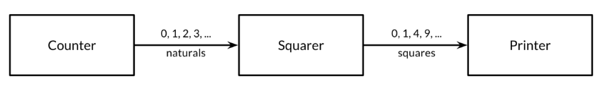

# **Goroutines and Channels**
## The fun just starts

https://talks.obedmr.com/


---

## Based on:

[The Go Programming Language Book](http://techbus.safaribooksonline.com/book/programming/go/9780134190570)

**Presentation and code examples**:

https://github.com/CodersSquad/hello-gophers


---

# Goroutines and Channels

Concurrent programming is the expression of a program as a composition of several autonomous activities.

Golang provides 2 styles of concurrent programming:

- **CSP** - Communicating Sequential Processes
- **Shared Memory** multithreading


---

# Goroutines

In Go, each concurrently executing activity is called a `goroutine`.

When a program starts, its only goroutine is the one that calls the main function. It's called the `main goroutine`.

```
  f()       // call f(); wait for it to return
  go f()    // create a new goroutine that calls f(); don't wait
```


---

## Example 1 - spinner

Source code: [`spinner.go`](./src/spinner.go)

```
func main() {
	go spinner(100 * time.Millisecond)
	const n = 45
	fibN := fib(n) // slow
	fmt.Printf("\rFibonacci(%d) = %d\n", n, fibN)
}
```

---

```
func fib(x int) int {
	if x < 2 {
		return x
	}
	return fib(x-1) + fib(x-2)
}
```

```
func spinner(delay time.Duration) {
	for {
		for _, r := range `-\|/` {
			fmt.Printf("\r%c", r)
			time.Sleep(delay)
		}
	}
}
```

---

## Example 2 - Concurrent Clock Server

Source code: [`clock1.go`](src/clock1.go)

```
func main() {
	listener, err := net.Listen("tcp", "localhost:9090")
	if err != nil {
		log.Fatal(err)
	}
	for {
		conn, err := listener.Accept()
		if err != nil {
			log.Print(err) // e.g., connection aborted
			continue
		}
		handleConn(conn) // handle one connection at a time
	}
}
```


---

```
func handleConn(c net.Conn) {
	defer c.Close()
	for {
		_, err := io.WriteString(c, time.Now().Format("15:04:05\n"))
		if err != nil {
			return // e.g., client disconnected
		}
		time.Sleep(1 * time.Second)
	}
}
```

Test with [`netcat.sh`](src/netcat.sh)
```
./netcat.sh
```

---

Test with [`netcat1.go`](src/netcat1.go)

```
func mustCopy(dst io.Writer, src io.Reader) {
	if _, err := io.Copy(dst, src); err != nil {
		log.Fatal(err)
	}
}

func main() {
	conn, err := net.Dial("tcp", "localhost:9090")
	if err != nil {
		log.Fatal(err)
	}
	defer conn.Close()
	mustCopy(os.Stdout, conn)
}
```

---

This is the real **concurrent** one

Source code: [`clock2.go`](src/clock2.go)

```
func main() {
	listener, err := net.Listen("tcp", "localhost:9090")
	if err != nil {
		log.Fatal(err)
	}
	for {
		conn, err := listener.Accept()
		if err != nil {
			log.Print(err) // e.g., connection aborted
			continue
		}
		go handleConn(conn) // handle connections concurrently
	}
}
```


---

## Let's philosophize

[Go Proverbs](https://go-proverbs.github.io/)

- Don't communicate by _sharing_ _memory_, _share_ _memory_ by communicating.

- _Concurrency_ is not _parallelism_.

- _Channels_ orchestrate; _mutexes_ serialize.


---

## Channels

If goroutines are the activities of a concurrent Go program, *channels* are the connections between them.

- A **channel** is a communication mechanism that lets one goroutine send values to another goroutine.

- A **channel** is a _reference_ to the data structure created by _make_

- A **channel** has 2 operations, _send_ and _receive_, also known as _communications_.


---

### Channels in code

```
  ch := make(chan int) // ch has type 'chan int'

  ch <- x  // a send statement

  x = <-ch // a receive expression in an assignment statement
  <-ch     // a receive statement; result is discarded

  close(ch) // To close a channel
```


---

## Unbuffered and Buffered Channels

Channels created with simple `make` is called as _unbuffered channel_.

But `make` could use a second parameter which indicates the channel's _capacity_. If this _capacity_ is non-zero, `make` will created a _buffered_ channel.

```
  ch = make(chan int)    // unbuffered channel
  ch = make(chan int, 0) // unbuffered channel
  ch = make(chan int, 3) // buffered channel with capacity 3
```


---

## Example 3 - Unbuffered Channels

Source code: [`netcat2.go`](src/netcat2.go)

```
func main() {
        ...
	done := make(chan int)
	go func() {
		io.Copy(os.Stdout, conn) // NOTE: ignoring errors
		log.Println("done")
		done <- 2 // signal the main goroutine
	}()
	x := 1
	x = <-done // wait for background goroutine to finish
	log.Println("Channel Closed with value: ", x)
	close(done)
}
```


---

## Pipelines

Pipelines are used to connect goroutines together so that the output of one can be the input to another.




---

## Example 4 - Pipelines

Source code: [`pipeline.go`](src/pipeline.go)

```
func main() {
	naturals := make(chan int)
	squares := make(chan int)

	// Counter
	go counter(naturals)
	// Squarer
	go squarer(naturals, squares)
	// Printer (in main goroutine)
	for x := range squares {
		fmt.Println(x)
	}
}
```


---

**Counter** goroutine code

```
func counter(naturals chan int) {
	for x := 0; x < 100; x++ {
		naturals <- x
	}
	close(naturals)
}
```


**Squarer** goroutine code
```
func squarer(naturals, squares chan int) {
	for x := range naturals {
		squares <- x * x
	}
	close(squares)
}
```

---

## Let's code: ClockWall

Follow the instructions in the link:
https://github.com/CodersSquad/go-clockwall

---

## More topics for second part

- Buffered and Unbuffered channels
- Pipelines
- Unidirectional Channel types
- Looping in Parallel
- Cancellation
- **Concurrency with Shared Variables** (third part)

Take a look on [The Go Programming Language](http://techbus.safaribooksonline.com/book/programming/go/9780134190570) book


---

# Thanks

- **Obed N Muñoz Reynoso**
	- Cloud Software Engineer
	- obed.n.munoz@``gmail | tec | intel``.com
