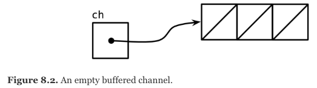
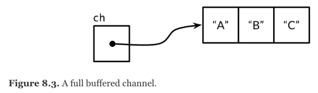

# **More about Goroutines and Channels**
## Yes, we have more

https://talks.obedmr.com/


---

## Summary

- Unidirectional Channels
- Buffered Channels
- Looping in Parallel


---

## Based on:

- [The Go Programming Language Book](http://techbus.safaribooksonline.com/book/programming/go/9780134190570)

- Presentation `code` and examples:
  https://github.com/CodersSquad/hello-gophers


---

# Unidirectional Channels

The unidirectional channel types expose only one or the other of the send and receive operations.

- The type **chan<- int**, a _send-only_ channel of int, allows send but not receive.

- Then, the type **<-chan int**, a _receive-only_ channel of int, allows receive but not send.


---

## Remember this?

```
 func counter(out chan int)
 func squarer(out, in chan int)
 func printer(in chan int)
```


```
func main() {
	naturals := make(chan int)
	squares := make(chan int)

	go counter(naturals)
	go squarer(squares, naturals)
	printer(squares)
}
```

---

## Example Pipeline


```
func counter(out chan<- int) {
	for x := 0; x < 100; x++ {
		out <- x
	}
	close(out)
}
```

```
func squarer(out chan<- int, in <-chan int) {
	for v := range in {
		out <- v * v
	}
	close(out)
}
```


---

```
func printer(in <-chan int) {
	for v := range in {
		fmt.Println(v)
	}
}
```


---

## Buffered Channels

A **buffered channel** has a queue of elements. The queue's maximum size is determined when it is created, by the capacity argument to `make`.

```
 ch = make(chan string, 3)
```




---

## Let's put something on this **buffered channel**

```
 ch <- "A"
 ch <- "B"
 ch <- "C"
```



```
 fmt.Println(cap(ch)) // "3"
 fmt.Println(<-ch) // "A"
 fmt.Println(<-ch) // "B"
 fmt.Println(<-ch) // "C"
```

---

## Looping in Parallel

- **Sequential mode**

```
 // makeThumbnails makes thumbnails of the specified files.
 func makeThumbnails(filenames []string) {
     for _, f := range filenames {
         if _, err := thumbnail.ImageFile(f); err != nil {
             log.Println(err)
         }
     }
 }
```


---

- **Parallel mode (1)**

```
 func makeThumbnails2(filenames []string) {
     for _, f := range filenames {
         go thumbnail.ImageFile(f) // NOTE: ignoring errors
     }
 }

```
- What's wrong with the previous example? is it correct or incorrect?


---

- **Parallel mode (2)**

```
 // makeThumbnails3 makes thumbnails of the specified files in parallel.
 func makeThumbnails3(filenames []string) {
     ch := make(chan struct{})
     for _, f := range filenames {
         go func(f string) {
             thumbnail.ImageFile(f) // NOTE: ignoring errors
             ch <- struct{}{}
         }(f)
     }

     // Wait for goroutines to complete.
     for range filenames {
         <-ch
     }
 }
```

---

## Concurrent Web Crawler (V1)

```
 func crawl(url string) []string {
     fmt.Println(url)
     list, err := links.Extract(url)
     if err != nil {
         log.Print(err)
     }
     return list
 }
```

---

```
 func main() {
     worklist := make(chan []string)

     // Start with the command-line arguments.
     go func() { worklist <- os.Args[1:] }()

     // Crawl the web concurrently.
     seen := make(map[string]bool)
     for list := range worklist {
         for _, link := range list {
             if !seen[link] {
                 seen[link] = true
                 go func(link string) {
                     worklist <- crawl(link)
                 }(link)
             }
         }
     }
 }
```

---

## Concurrent Web Crawler (V1) execution

```
 $ go run crawl1.go http://gopl.io/
 http://gopl.io/
 https://golang.org/help/
 https://golang.org/doc/
 https://golang.org/blog/
 ...
 2015/07/15 18:22:12 Get ...: dial tcp: lookup blog.golang.org: no such host
 2015/07/15 18:22:12 Get ...: dial tcp 23.21.222.120:443: socket:
                                                         too many open files
 ...
```

---

## Concurrent Web Crawler (V2)

```
 // tokens is a counting semaphore used to
 // enforce a limit of 20 concurrent requests.
 var tokens = make(chan struct{}, 20)

 func crawl(url string) []string {
     fmt.Println(url)
     tokens <- struct{}{} // acquire a token
     list, err := links.Extract(url)
     <-tokens // release the token

     if err != nil {
         log.Print(err)
     }
     return list
 }
```


---

```
 func main() {
     worklist := make(chan []string)
     var n int // number of pending sends to worklist

     // Start with the command-line arguments.
     n++
     go func() { worklist <- os.Args[1:] }()

     // Crawl the web concurrently.
     seen := make(map[string]bool)
     for ; n > 0; n-- {
         list := <-worklist
         for _, link := range list {
             if !seen[link] {
                 seen[link] = true
                 n++
                 go func(link string) {
                     worklist <- crawl(link)
                 }(link)
             }
         }
     }
 }
```

---

## Let's Code: Deph-limiting web crawler

Add depth-limiting to the concurrent crawler. That is, if the user sets `-depth=3`, then only URLs reachable by at most three links will be fetched.

https://github.com/CodersSquad/go-web-crawler


---

# Thanks

- **Obed N Muñoz Reynoso**
	- Cloud Software Engineer
	- obed.n.munoz@``gmail | tec | intel``.com
